# How to Integrate ESP with Relational Databases using DB Connector

## Table of Contents


* [Overview](#overview)
	* [Prerequisites](#prerequisites)
* [Getting Started](#getting-started)
	* [Steps to connect to Microsoft Azure SQL Database](#steps-to-connect-to-microsoft-azure-sql-database)
	* [Steps to connect to Azure Database for PostgreSQL](#steps-to-connect-to-azure-database-for-postgresql)
* [Running](#running)
	* [Steps to run project for reading and writing data to Microsoft Azure SQL Database](#steps-to-run-project-for-reading-and-writing-data-to-microsoft-azure-sql-database)
	* [Steps to run project for reading and writing data to Microsoft Azure Database for PostgreSQL](#steps-to-run-project-for-reading-and-writing-data-to-microsoft-azure-database-for-postgresql)
* [Summary](#summary)
* [Contributing](#contributing)
* [License](#license)
* [Additional Resources](#additional-resources)

## Overview
The database connector in SAS Event Stream Processing (ESP) can be utilized in two ways: with DataDirect Drivers or with SAS Threaded Kernel Drivers. This repository will explain how to utilize the Database Connector with DataDirect Drivers in ESP to read and write data to relational databases like Microsoft SQL Server and PostgreSQL on Azure.

Currently, the DataDirect ODBC drivers are only certified for the following databases: Oracle, MySQL, IBM DB2, Greenplum, PostgreSQL, SAP Sybase ASE, Teradata, Microsoft SQL Server, IBM Informix and Sybase IQ. In this tutorial we are connecting to databases on Azure, these steps could also be utilized to connect to an on-premise database

Key Takeaways:
*	Learn how to use database connector with DataDirect drivers.
*	Learn how to configure the connector using the configuration file e.g. odbc.ini 
*	Learn what is the configuration file “odbc.ini” and what are the important parameters to be considered.


### Prerequisites

1. SAS ESP on Viya 4 (2020.1.2) and above on Linux environment.
2. A valid Microsoft Azure subscription.
3. Microsoft Azure Data Studio.
4. Azure SQL Database or Azure Database for PostgreSQL

## Getting Started

This section explains the process to configure the database connector using odbc.ini file and to set up required environment variables.

We would be using odbc.ini file to configure the Event Stream processing (ESP) database connector.The odbc.ini file is the configuration file that stores the definitions for all the ODBC DSNs in a Linux environment.These ODBC DSNs are defined by specifying values for certain DSN parameters. This file is activated by the environment variable ODBCINI, and is required by all ODBC applications. By default, the odbc.ini file is installed in "/opt/sas/viya/config/etc/SASEventStreamProcessingEngine/default" on the ESP server pod.You must configure this file so that ESP can access ODBC data sources i.e. Azure SQL Database, Azure database for PostgreSQL.

Description of some of the attributes which we would edit in the default odbc.ini file are:

- *EncryptionMethod* :  This defines the method which the driver uses to encrypt data sent between the driver and the database server.If it is set to 0 (No Encryption), data is not encrypted.
If set to 1 (SSL), data is encrypted using the SSL protocols specified in the Crypto Protocol Version connection option.
- *HostName* : The name or the IP address of the server to which we want to connect.
- *PortNumber* : The port number of the server listener.
- *Truststore* : Specify the path to the directory that contains the truststore file and the truststore file name to be used when SSL is enabled e.g. Encryption Method=1 and server authentication is used. The truststore file contains a list of the valid Certificate Authorities (CAs) that are trusted by the client machine for SSL server authentication.
- *Database* : Specifies the name of the database to which you want to connect.
- *ValidateServerCertificate* : This attribute specifies whether the driver validates the certificate that is sent by the database server when SSL encryption is enabled e.g. Encryption Method=1.If set to 1 (Enabled), the driver validates the certificate that is sent by the database server. Any certificate from the server must be issued by a trusted CA in the truststore file.If set to 0 (Disabled), the driver does not validate the certificate that is sent by the database server. The driver ignores any truststore information specified by the Truststore attribute.


Steps to follow for each database:
* For Azure SQL Database:
    1.	Follow the section “Steps to connect to Microsoft Azure SQL Database”
    2.	Under section “Running” follow the section “Steps to run project for reading and writing data to Microsoft Azure SQL Database” to run the sample project.
* For Azure database for PostgreSQL:
    1.	Follow the section “Steps to connect to Azure Database for PostgreSQL”
    2.	Under section “Running” follow the section “Steps to run project for reading and writing data to Microsoft Azure Database for PostgreSQL” to run the sample project.


### Steps to connect to Microsoft Azure SQL Database

1. Create a Microsoft Azure SQL Database on Azure. Refer to the [Link](https://docs.microsoft.com/en-us/azure/azure-sql/database/single-database-create-quickstart?tabs=azure-portal) if you are not familiar with creating an Azure SQL Database.

2. Connect to the database in Azure Data studio. We would check the data written to Database by ESP using it. Refer to the [Link](https://docs.microsoft.com/en-us/sql/azure-data-studio/quickstart-sql-database?toc=%2Fazure%2Fsql-database%2Ftoc.json&view=sql-server-ver15) to know how to connect and query Azure SQL database from Azure Data Studio.

3. Let's assume you have the HostName as "test.database.windows.net" and database name as "mydb" in the next steps.

4. Check the content of odbc.ini file driver section *SQLServer* [here](AzureSqlDB/odbc.ini). See that the attributes discussed above are set as : 
    * Database= mydb
    * EncryptionMethod= 1
    * HostName= test.database.windows.net
    * PortNumber= 1433
    * TrustStore= /etc/pki/tls/cert.pem
    * ValidateServerCertificate= 1

    Kindly change the Database, HostName and PortNumber attributes as per your database in the odbc.ini file.  

5. This odbc.ini file should be uploaded to the mounted shared folder "/mnt/data" so that it is accessible to ESP server pod.Assuming that your environment has the required overlays applied you would have "/mnt/data" folder available.If not then ask your Kubernetes Admin to have the overlays for "sas-event-stream-processing-studio-app/pvc" e.g. resources.yaml which is a PersistentVolumeClaim and pvc-transformer.yaml used to set the env variable for the PVC applied to your cluster.

6. Upload the odbc.ini file using available file browser to the "/mnt/data" folder.You can also use "Kubectl cp" command to copy the file inside a running ESP server pod if you dont have a file browser configured.
7. Similar to above upload the data file *test.csv* to "/mnt/data" folder.

8. Set the environment varaibles on ESP studio settings as "*ODBCINI*" which should have the value as "*/mnt/data/odbc.ini*" and "*LD_LIBRARY_PATH*" with value "*/opt/sas/viya/home/SASEventStreamProcessingEngine/lib:/opt/sas/viya/home/SASFoundation/sasexe:/opt/sas/viya/home/SASEventStreamProcessingEngine/ssl/lib*" Checkout the [Link](https://go.documentation.sas.com/?cdcId=espcdc&cdcVersion=v_004&docsetId=espstudio&docsetTarget=p0wfkuc7b3jhnsn1814o0c9e85hpss03.htm&locale=en) to learn on how to set environment variables on ESP Studio if you are not familiar with it.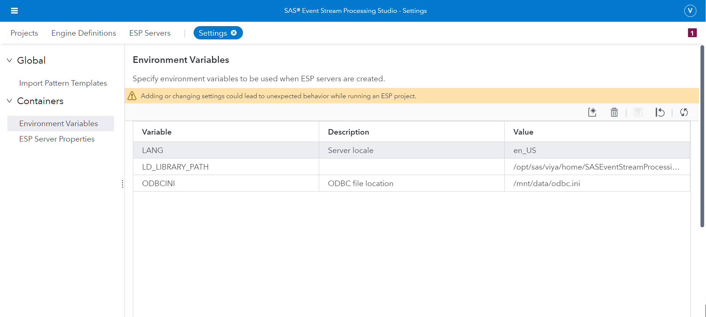


### Steps to connect to Azure Database for PostgreSQL

1. Create a Microsoft Azure Database for PostgreSQL on Azure. Refer to the [Link](https://docs.microsoft.com/en-us/azure/postgresql/quickstart-create-server-database-portal) if you are not familiar with creating an Azure Database for PostgreSQL.

2. Connect to the database in Azure Data studio. We would check the data written to database by ESP using it. Refer to the [Link](https://docs.microsoft.com/en-us/sql/azure-data-studio/quickstart-postgres?view=sql-server-ver15) to know how to connect and query Azure Database for PostgreSQL from Azure Data Studio.

3. Let's assume you have the HostName as "test.postgres.database.azure.com" and database name as "mydb" in the next steps.

4.  Check the content of odbc.ini file driver section *PostgreSQL* [here](PostgreSQL/odbc.ini). See that the attributes discussed above are set as : 
    * Database= mydb
    * EncryptionMethod= 1
    * HostName= test.postgres.database.azure.com
    * PortNumber= 5432
    * TrustStore= /etc/pki/tls/cert.pem
    * ValidateServerCertificate= 1

    Kindly change the Database, HostName and PortNumber attributes as per your database in the odbc.ini file.

5. Perform step 5 to 8 mentioned above in section *Steps to connect to Microsoft Azure SQL Database*.


## Running

### Steps to run project for reading and writing data to Microsoft Azure SQL Database

You would read and write the data to Azure Sql DB utilizing the ESP project *databaseconnectorazuresql*. In this project *ReadDataFromFile* source window is using the file socket connector to read the  data from a csv file (*test.csv*).
The *Copy1* window has a database connector which is writing that data to the database in *Sensor* table. There is another source window *ReadDataFromDB* which is trying to read the data from the same *Sensor* table utilizing the database connector.

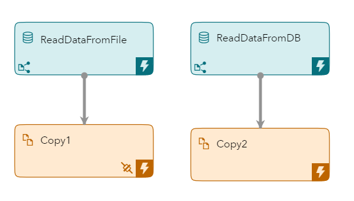
1. Import the project file *databaseconnectorazuresql.xml* present [here](AzureSqlDB/databaseconnectorazuresql.xml) to ESP studio.


2. In the *Copy1* window under *Subscriber Connectors* section you have a database connector with the name "AzureSqlDB".Edit that and change the *connectstring* by adding your *uid & pwd* which is your user id and password respectively for your database.Lets assume your user id is "*mike*" and password for database is "Test123$" then you can get your encrypted password using OpenSSL with below command:
    ```
    echo Test123$ | openssl enc -e -aes-256-cbc -a -salt -pass pass:espDBconnectorUsedByUser=mike
    ```
    Place that encrypted password in pwd field.


3. In the window *ReadDataFromDB* under *Input Data (Publisher) Connectors* you have database connector "AzureSQL".Edit that and add the *uid and pwd* properties for connector as done in step 2 above.

4. Save your project.

5. Create table in your database by running the following statement in *Azure Data Studio* which is connected to your Azure SQL Database :

        
        CREATE TABLE Sensors(
          id bigint NOT NULL PRIMARY KEY,
          Datetime smalldatetime NOT NULL,
          Value FLOAT,
          Device_ID varchar(255),
          Sensor_ID varchar(255)
        );
        
        
6. Run your project in ESP Studio.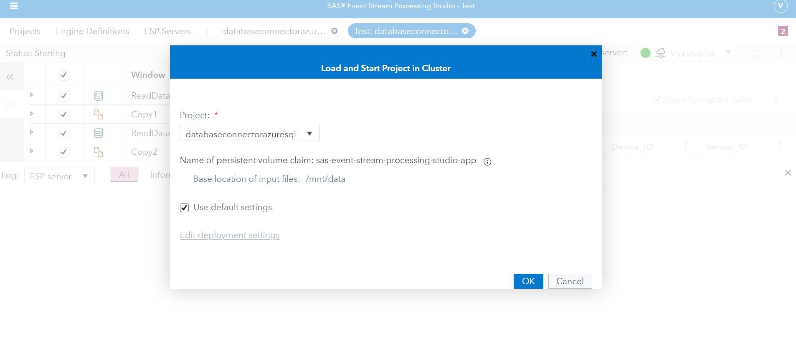
   

7. You would be able to see the data being read from file *test.csv* and being written to the database in first run under *ReadDatafromFile* tab. But as there is no data yet in the database so you would not be able to see any data being read from DB in tab "ReadDataFromDb".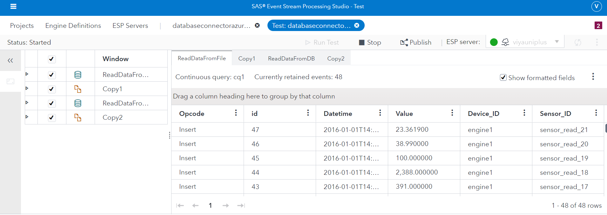

8. Query the data on *Sensors* table using Azure Data Studio to see the inserted data in the database. 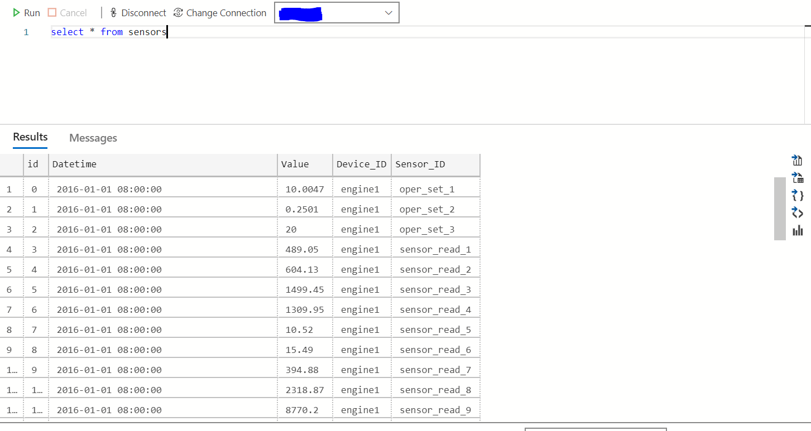

9. Stop the project and re-run, this time you would be able to see the data being read from the database as shown in below picture. 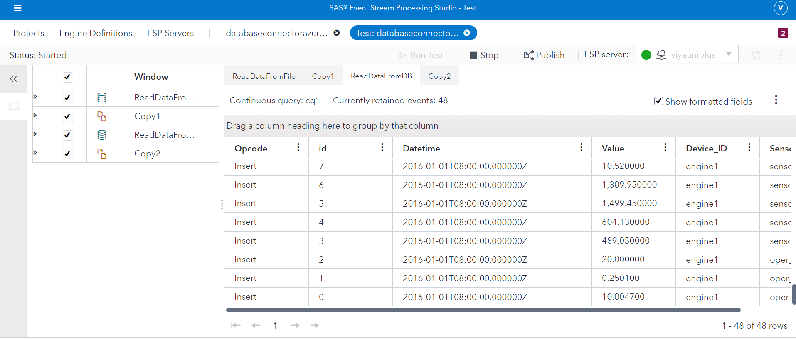


### Steps to run project for reading and writing data to Microsoft Azure Database for PostgreSQL

You would read and write the data to Azure Database for PostgreSQL utilizing the ESP project *databaseconnectorazurepostgresql.xml*. In this project *ReadDataFromFile* source window is using the file socket connector to read data from a csv file (*test.csv*). The *Copy1* window has a database connector which is writing that data to the database in *Sensor* table. There is another source window *ReadDataFromPostgreSqlDb* which is trying to read the data from the same *Sensor* table utilizing the database connector.
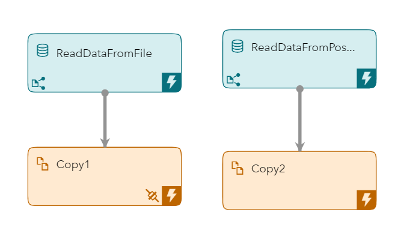

1. Import the project file *databaseconnectorazurepostgresql.xml* present [here](PostgreSQL/databaseconnectorazurepostgresql.xml) to ESP studio.

2. In the *Copy1* window under *Subscriber Connectors* section you have a database connector with the name "PostgreSqlDB".Edit that and change the *connectstring* by adding your *uid & pwd* which is your user id and password respectively for your database.Lets assume your user id is "*mike@test*" and password for database is "Test123$" then you can get your encrypted password using OpenSSL with below command:
    ```
    echo Test123$ | openssl enc -e -aes-256-cbc -a -salt -pass pass:espDBconnectorUsedByUser=mike@test
    ```
    Place that encrypted password in pwd field. 
3. In the window *ReadDataFromPostgreSqlDb* under *Input Data (Publisher) Connectors* you have database connector "PostgreSQLAzure". Edit that and add the *uid and pwd* properties for connector as done in step 2 above.
4. Save your project.

5. Create table in your database by running the following statement in *Azure Data Studio* which is connected to your Azure Database for PostgreSQL :
    ```
    CREATE TABLE Sensors(
    id BIGINT NOT NULL PRIMARY KEY,
    Datetime TIMESTAMP NOT NULL,
    Value FLOAT,
    Device_ID VARCHAR(255),
    Sensor_ID VARCHAR(255)
    );
    ```

6. Run your project in ESP Studio.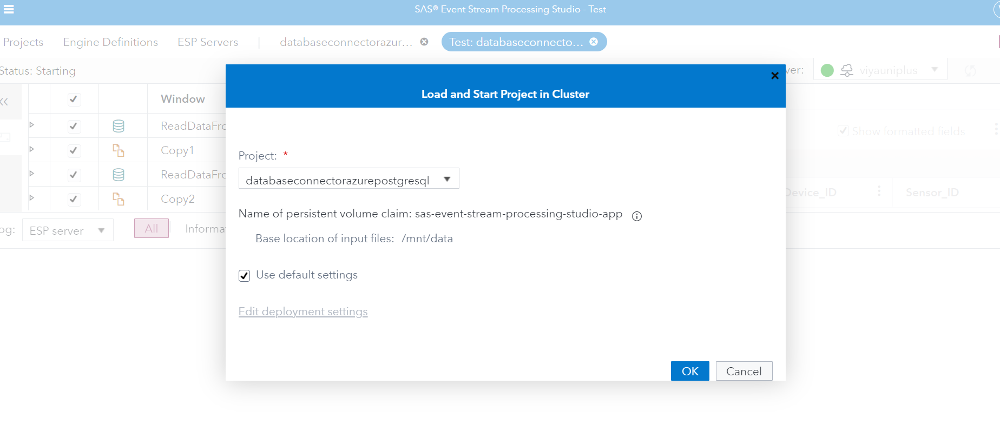

7. You would be able to see the data being read from file *test.csv* and being written to the database in first run under *ReadDatafromFile* tab. But as there is no data yet in the database so you would not be able to see any data being read from DB in tab *"ReadDataFromPostgreSqlDb"*.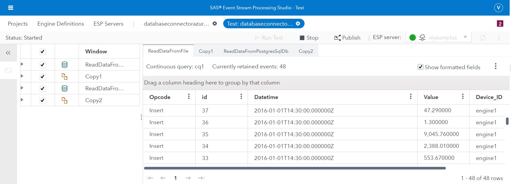

8. Query the data on *Sensors* table using Azure Data Studio to see the inserted data in the database. 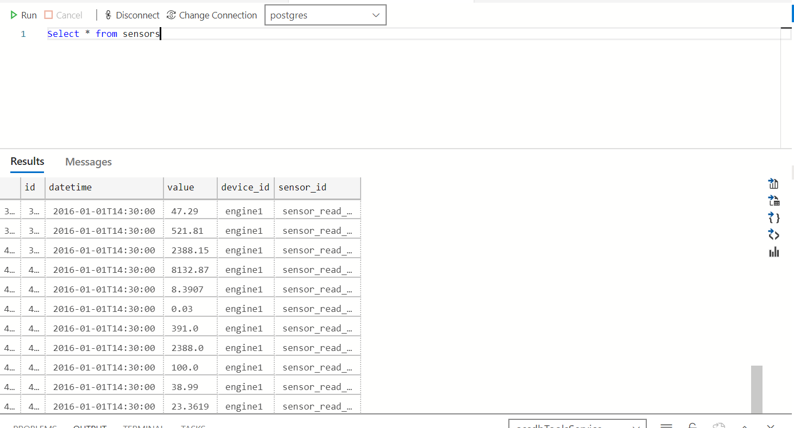

9. Stop the project and re run, this time you would be able to see the data being read from the database as shown in below picture. 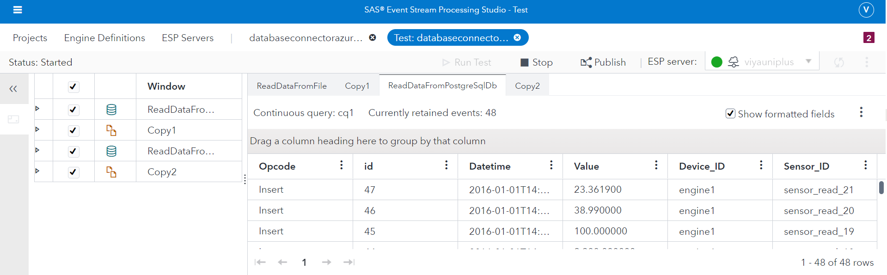

## Summary

This repository has shown how to utilize SAS ESP Database connector to integrate with Relational Databases like Azure SQL Database and Azure Database for PostgreSQL for reading and writing data.Similar approach could be utilized to connect to the other supported databases like MySQL etc. whether on-premise or on cloud.

## Contributing

> We welcome your contributions! Please read [CONTRIBUTING.md](CONTRIBUTING.md) for details on how to submit contributions to this project. 

## License

> This project is licensed under the [Apache 2.0 License](LICENSE).

## Additional Resources

* SAS ESP Database Connnector : [Link](https://go.documentation.sas.com/?cdcId=espcdc&cdcVersion=v_004&docsetId=espca&docsetTarget=p0kqcqs0y2r24yn1c94ick5yudkh.htm&locale=en)
* Microsoft Azure Docs : [Link](https://docs.microsoft.com/en-us/azure/?product=featured)
* SAS Communities : [Link](https://communities.sas.com/)
